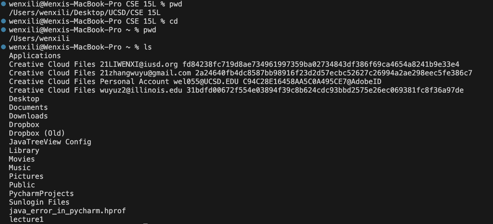
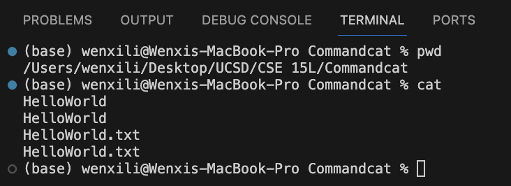
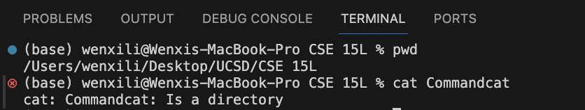
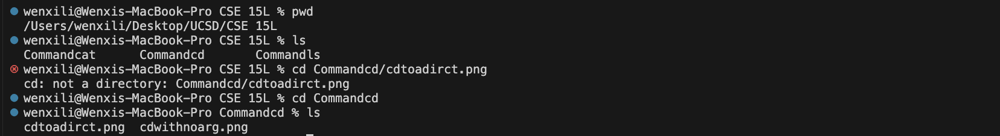

# Lab Report 1
## Share an example of using the command with no arguments.
  __1. cd__
        
     
     `cd`
     
  Absolute path: /Users/wenxili/Desktop/UCSD/CSE 15L
     
  The command cd with no argument means bring me to the home directory so after I executed cd with no arg the absolute path become /Users/wenxili
     
  The output is not an error.

  __2. ls__  
      
      
     `ls`  
     
  Absolute path: /Users/wenxili/Desktop/UCSD/CSE 15L  
     
  The command ls with no argument shows all files in the current directory. I have three folders in CSE 15L: Commandcat Commanded Commandls. Therefore ls shows these three folders.  
     
  The output is not an error.  
  
  __3. cat__
        
     
     `cat`
     
  Absolute path: /Users/wenxili/Desktop/UCSD/CSE 15L/Commandcat
     
  The command cat with no argument waits for me to enter some text directly into the terminal, and after I press enter, the terminal will print one more time the text that I input. This behavior will end when I press control+d. Then the terminal will resume and I can use other terminal command normally.  
  The output is not an error.
  
## Share an example of using the command with a path to a directory as an argument.  
  __1. cd__
        
     
      `cd Commandcd`  
     
  Absolute path: /Users/wenxili/Desktop/UCSD/CSE 15L  
     
  There is a folder named Commandcd within the folder CSE 15L. The command brings me into the file I specified (Commandcd) as after I executed cd the absolute path become /Users/wenxili/Desktop/UCSD/CSE 15L/Commandcd  
     
  The output is not an error.  
  
  __2. ls__  
        
     
     `ls Commandls`  
     
  Absolute path: /Users/wenxili/Desktop/UCSD/CSE 15L  
     
  There is a folder named Commandls within the folder CSE 15L. The command shows all files in the folder I specified (Commandls), when I execute the command there is one png (lsnoarg) inside the folder Commandls therefore the ouput is lsnoarg.  
     
  The output is not an error.  

  __3. cat__
        
     
      `cd Commandcd`  
     
  Absolute path: /Users/wenxili/Desktop/UCSD/CSE 15L  
     
  There is a folder named Commandcd within the folder CSE 15L. The command produces an error since cat is suppose to take a file or multiple files and print the contents of file/files.  
  The output is an error since cat argument need to be type file, cannot directly prints a directory.   
  
## Share an example of using the command with a path to a file as an argument.
  __1. cd__
       
     
     `cd Commandcd/cdtoadirct.png`  
     
   Absolute path: /Users/wenxili/Desktop/UCSD/CSE 15L  
     
   There is a folder Commandcd inside the folder CSE 15L and there is png named cdwithnoarg inside Commandcd. The command produces an error since cd cannot open a file.
     
   The output is an error since since cd is suppose to take directory and change the current directory. cd can be use to direct into a folder but it cannot directly open a file.

  __2. ls__  
    
  
      `cd Commandcd/cdtoadirct.png`  
      
   Absolute path: /Users/wenxili/Desktop/UCSD/CSE 15L  
   There is a folder Commandls inside the folder CSE 15L and there is a file named cdtoadirct.png inside Cammmandls. The command read the directory file and the file name is listed.  
   The output is not an error.

