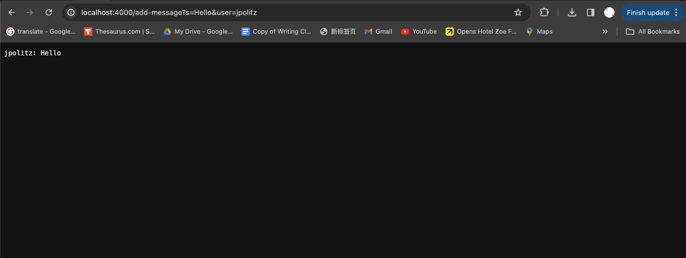
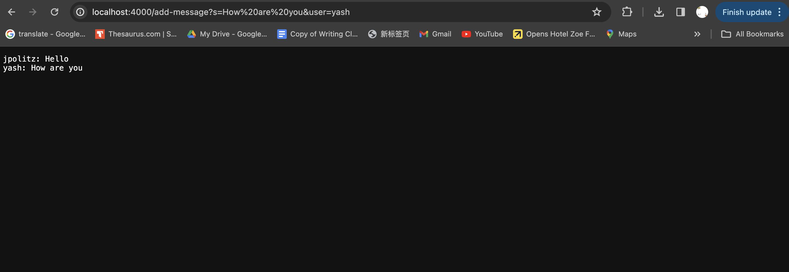
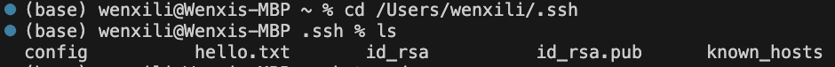
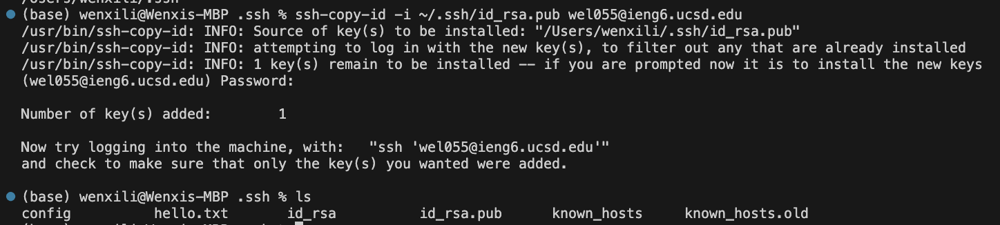
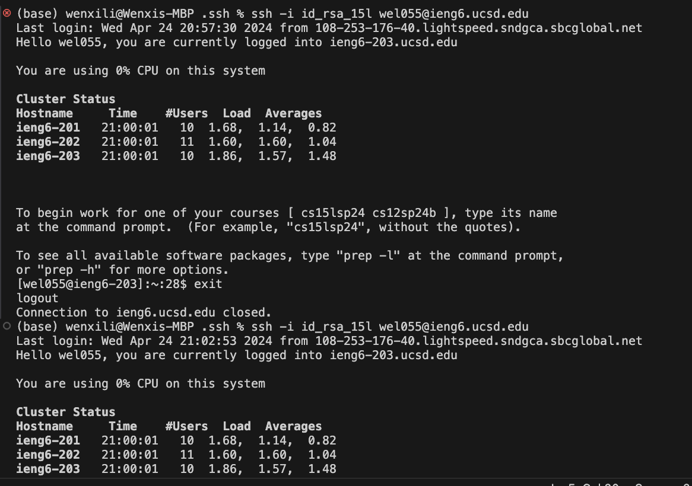

# Lab Report 2
## Part 1
  __Code for ChatServer__
    
     
  __Screen shots of requests__
    
     
  `/add-message?s=Hello&user=jpolitz`
     
  Methods Called:  
  `handleRequest(URI url)` is called by the server framework when a request is received.  
  Arguments and Values:  
  `url`: The URI object would have a string representation of `/add-message?s=Hello&user=jpolitz`.  
  Before the request, assuming chatHistory is empty, `chatHistory.toString()` would return an empty string.  
  Field Changes:  
  chatHistory would change from previous chat (in this case empty) to append jpolitz: `Hello\n`, resulting in `chatHistory.toString()` returning `jpolitz: Hello\n`.  
  
    
  
  `/add-message?s=How are you&user=yash`  

  Methods Called:  
  `handleRequest(URI url)` is called by the server framework when a request is received.  
  Arguments and Values:  
  `url`: The URI object would have a string representation of `/add-message?s=How are you&user=yash`.  
  Before this second request, `chatHistory.toString()` would return `jpolitz: Hello\n`.  
  Field Changes:  
  chatHistory would append `yash: How are you\n` to previous message.

  

## Part 2  

  __1__  
    

  __2__
    
  
  __3__
    
