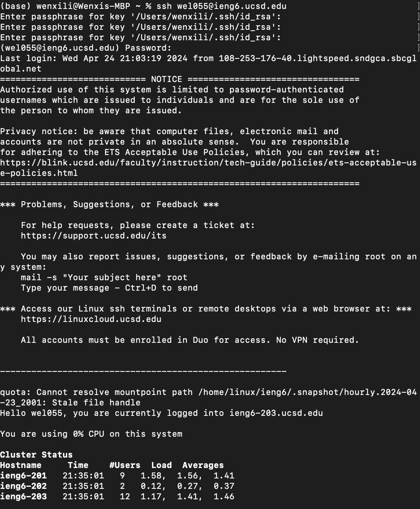
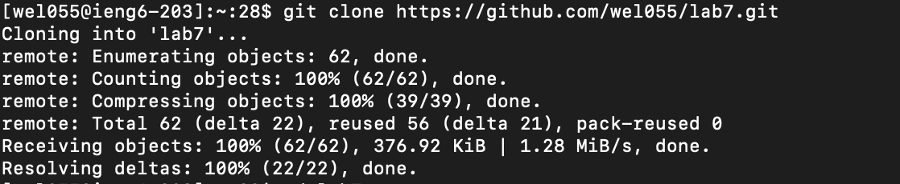
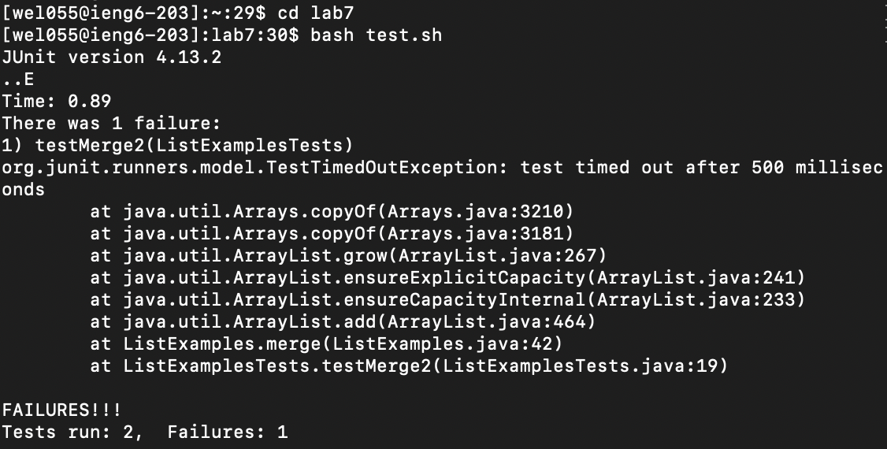
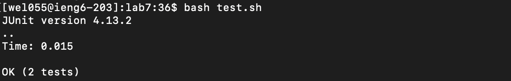
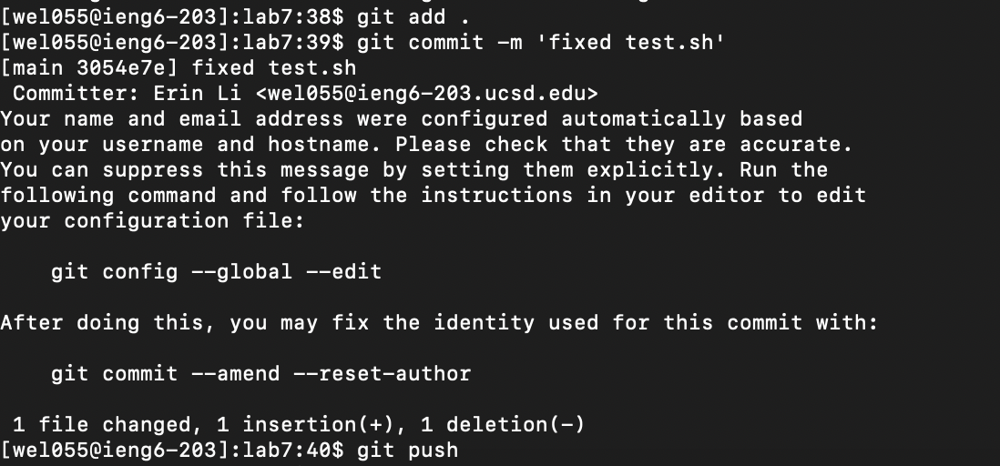

# Lab Report 3
4. I Log into ieng6 with `ssh wel055@ieng6.ucsd.edu`
   
   
   
   Effect: successful log on
   
5. Clone my fork with `git clone https://github.com/wel055/lab7.git`
   
   
   
   Effect: successful cloned lab7.git
   
6. First `cd lab7`
   
   Effect: direct into lab7 folder  
   Then `bash test.sh`  
   Effect: run the test for ListExamples.java, shows that 1 fails  
   
   
7. Enter vim mode by `vim test.sh`
   I press down 26 times and press right one time to navigate to the index1 which need to be changed to index2.
   Then I press `i` to enter edit mode, I changed 1 to 2.
   Then I press `esc` to exit edit mode.
   Then I press`:wq` to exit vim.
   
   
8. I ran `bash test.sh`  
   
   Effect: run the test for ListExamples.java, shows that all tests passed.
   
9. I ran `git add .` then `git commit -m 'fixed test.sh'` then `git push`
      
   Effect: saved all changes to github  
